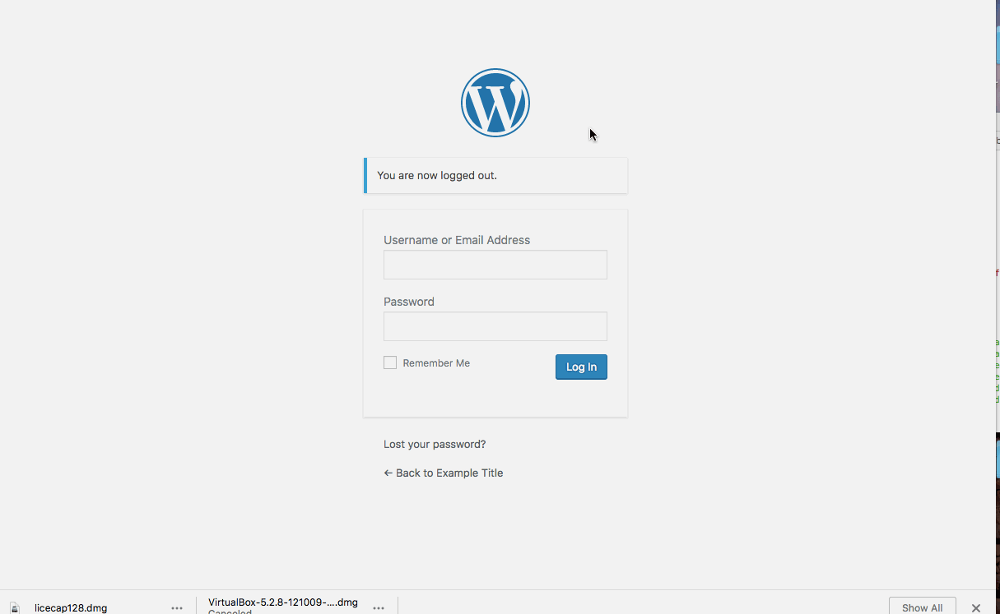
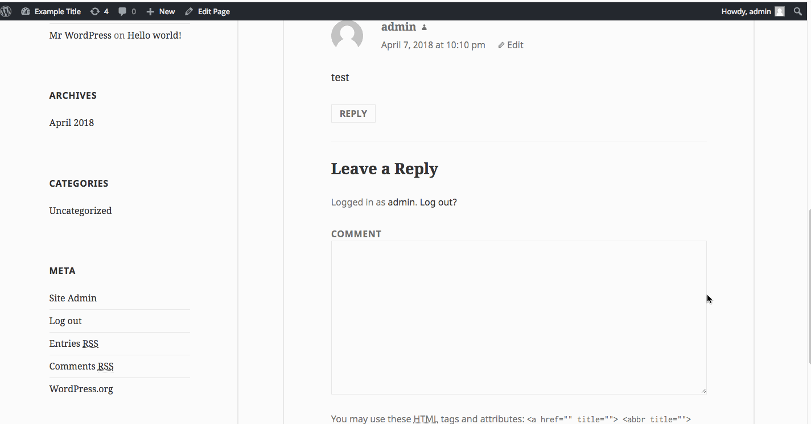
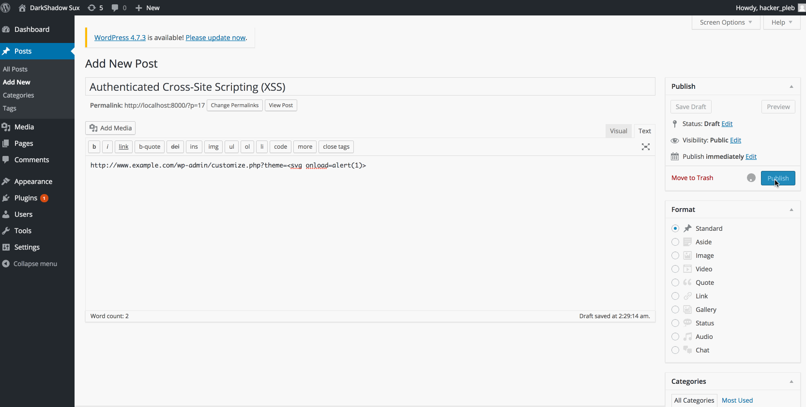

# Week-07-Web-Security
Week 7 of Web Security Class

#### Version 4.2 of Wordpress

1. Here we can see user enumeration. It is easy to see if a user exists or not which is not good for security. We can find usernames and then bruteforce passwords easily
  * 

2. Here we are performing an XSS attack by putting in a comment that when hovered over pops an alert
  * 
  
 3. This is another example of an xss attack where we are adding a link and adding an alert to the end of it
  * 
